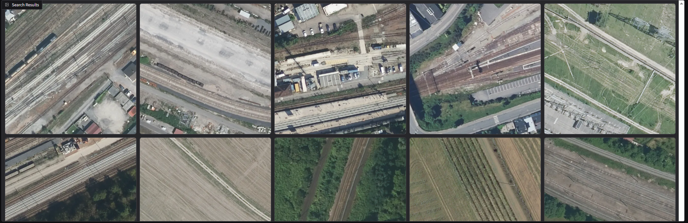
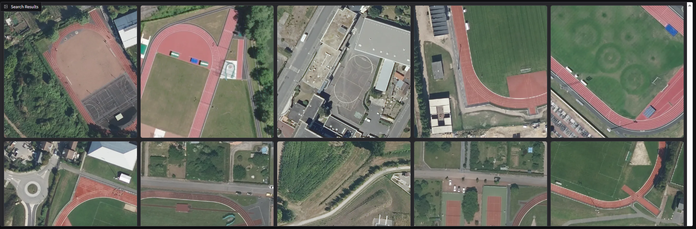
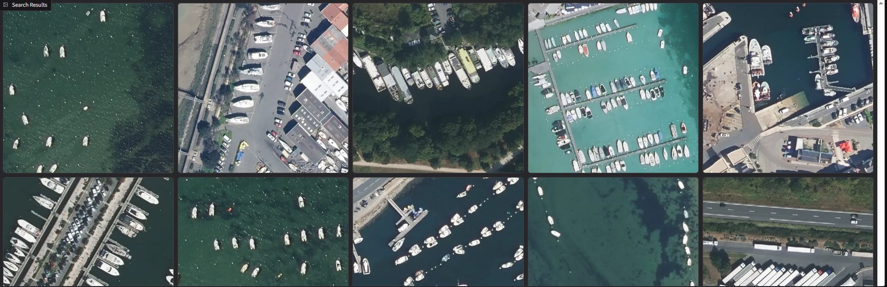

# FLAIR CLIP Retrieval

This is a small prototype to search [IGN's FLAIR dataset](https://huggingface.co/datasets/IGNF/FLAIR) using OpenAI's CLIP model for text-based image retrieval. ChromaDB is used to store and query the CLIP embeddings locally.

## Results for different queries

### "Train tracks"



### "Running track"


### "Boats"



## Quickstart
```sh
pip install -r requirements.txt
python main.py
```

By default, the interface will be available at `http://localhost:8080`.

This project uses the **FLAIR dataset** from IGNF. The dataset will be automatically downloaded via `datasets` at first launch and may take a few minutes.
